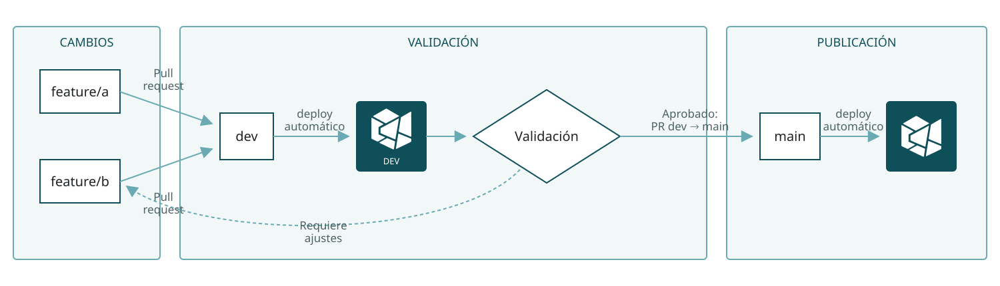
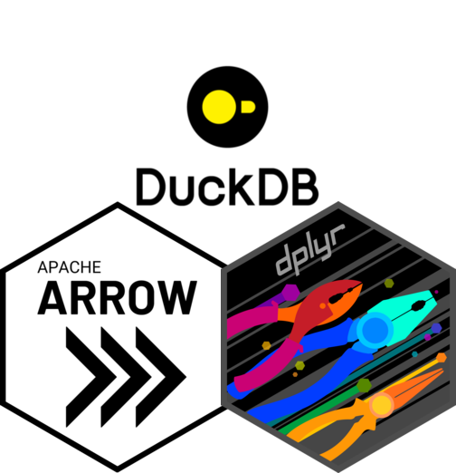
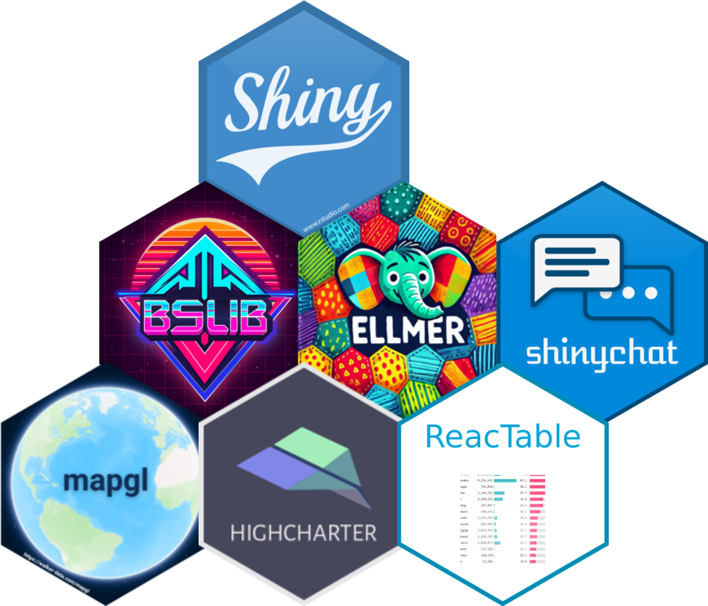
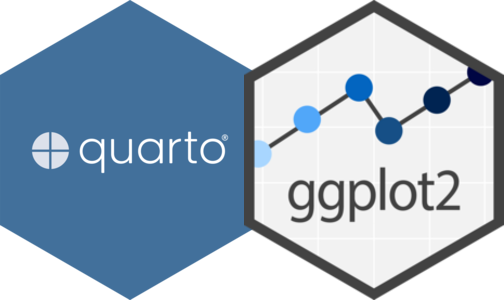

```{r}
#| include: false
# Lee un archivo de código R y lo inserta en la presentación como un bloque
# Markdown. Si recibe `descriptions`, también agrega anotaciones numeradas para
# explicar rangos específicos de líneas durante la presentación.
#
# Requisitos para que funcione:
# - El archivo indicado en `path` debe existir, usando una ruta relativa a este QMD.
# - El chunk debe usar `results: asis` al llamar la función, para que Quarto
#   interprete el Markdown generado en vez de mostrarlo como texto.
# - `descriptions` debe ser un vector nombrado: los nombres son rangos de líneas
#   (por ejemplo, "2-5") y los valores contienen las explicaciones.
# - Las líneas indicadas deben existir en el archivo leído.
code_block <- function(path, descriptions = NULL) {
  code <- readLines(path, encoding = "UTF-8", warn = FALSE)
  if (is.null(descriptions)) return(cat("```r", paste(code, collapse = "\n"), "```", sep = "\n"))
  ranges <- names(descriptions)
  first_lines <- as.integer(sub("-.*", "", ranges))
  code[first_lines] <- paste(code[first_lines], sprintf("# <%d>", seq_along(descriptions)))
  fence <- sprintf('```{.r code-line-numbers="|%s"}', paste(ranges, collapse = "|"))
  # Quarto usa el primer número para vincular la nota con su marcador. El
  # segundo se conserva dentro del contenido visible del tooltip.
  notes <- sprintf("%d. **%d.** %s", seq_along(descriptions), seq_along(descriptions), descriptions)
  cat(fence, paste(code, collapse = "\n"), "```", "", notes, sep = "\n")
}

```

## Programa {.section-slide .has-image style="--section-image: url('/assets/slides/regions/14.jpg');"}

::: {.section-subtitle}
01 · Problema<br>
02 · Funcionalidades & Demo<br>
03 · Arquitectura<br>
04 · Desafíos y calidad del dato<br>
05 · Taller
:::

## Problema {.section-slide .has-image style="--section-image: url('/assets/slides/regions/02.jpg');"}

::: {.section-subtitle}
Los datos están ahí. Llegar a ellos todavía cuesta.
:::

## Funcionalidades & Demo {.section-slide .has-image style="--section-image: url('/assets/slides/regions/04.jpg');"}

::: {.section-subtitle}
Preguntar, explorar y visualizar el territorio.
:::

## Arquitectura {.section-slide .has-image style="--section-image: url('/assets/slides/regions/05.jpg');"}

::: {.section-subtitle}
Un conjunto de componentes que colaboran entre sí.
:::

## Tres componentes, tres repositorios {.center}

Cada componente se administra y documenta en un repositorio propio.

<div class="cards" style="--cards: 3" data-flow data-center aria-label="Arquitectura general de CensoLab">
<article class="fragment">
  <small>01 · Datos</small>
  <h3>censolab-data</h3>
  <p>Prepara y documenta los datos.</p>
  <code>DuckDB → MotherDuck</code>
</article>
<article class="fragment">
  <small>02 · Aplicación</small>
  <h3>censolab</h3>
  <p>Consulta datos y coordina tools.</p>
  <code>Shiny + CensoBot</code>
</article>
<article class="fragment">
  <small>03 · Web</small>
  <h3>censolab-web</h3>
  <p>Publica el sitio y los resultados de evaluación a CensoBot.</p>
  <code>Quarto + GitHub Pages</code>
</article>
</div>

## 01 · Datos

::: {.incremental}

1. **Fuentes**  
   Censo 2024, cartografía censal y establecimientos de educación y salud.

2. **Configuración**  
   Un YAML versionado define fuentes, rutas y opciones.

   ```yaml
   # censo_config.yml
   sources:
     microdatos:
       url: https://storage.googleapis.com/bktdescargascenso2024/viv_hog_per_censo2024.zip
   options:
     simplify_geometry: true
   ```

3. **Pipeline R**  
   Descarga, integra y enriquece datos; simplifica geometrías y genera metadatos y contexto.

4. **DuckDB**  
   Base analítica portable, sin servidor y con soporte geoespacial. Puede publicarse en MotherDuck para consultas remotas.

:::


## 02 · Aplicación&nbsp;<span style="color: #6aaab2;">/&nbsp;Funcionamiento</span> {.center}

::: {.incremental}

1. **Explorador**<br>
   Interfaz centrada en el mapa para explorar indicadores por nivel territorial mediante mapas, gráficos y tablas.

2. **Agente**<br>
   Guiado por un prompt de comportamiento y restricciones, utiliza herramientas para consultar datos, responder preguntas y representar resultados en la interfaz.

3. **Comparador**<br>
   Permite contrastar indicadores entre distintos territorios mediante visualizaciones coordinadas.

4. **Perfil territorial**<br>
   Resume los principales indicadores inspirado en *DataChile*, además de poder navegar por niveles de la jerarquía geográfica.
:::

## 02 · Aplicación&nbsp;<span style="color: #6aaab2;">/&nbsp;Despliegue</span> {.center}

- Los cambios se validan primero en **CensoLabDev** y luego se promueven a `main` para publicar **CensoLab**.
- Existen dos versiones de la aplicación alojadas en **Posit Connect Cloud**, con despliegues automáticos para ambos entornos.

<!-- Ejecuta R/generate_deployment_flow.R desde la raíz del repositorio para regenerar este SVG. -->
{width="100%"}


## 03 · Sitio web

:::: {.columns}
::: {.column width="50%"}
### Sitio y publicación

- El sitio está construido con **Quarto**.
- Se publica automáticamente en **GitHub Pages**.
- Reúne la presentación, documentación, slides y páginas públicas del proyecto.
:::

::: {.column width="50%"}
### Resultados de evaluación

- El repositorio de la aplicación genera evaluaciones con `{vitals}` como un subproducto de su desarrollo.
- El sitio publica los resultados exportados de esas evaluaciones.
- Quarto los convierte en un resumen público de cobertura y desempeño.
:::
::::

## Paquetes principales por componente {.center}

<div class="cards" style="--cards: 3" aria-label="Paquetes principales de cada componente">
<article>
  <small>01 · Datos</small>
  
</article>
<article>
  <small>02 · Aplicación</small>
  
</article>
<article>
  <small>03 · Sitio web</small>
  
</article>
</div>

## Desafíos y calidad del dato {.section-slide .has-image style="--section-image: url('/assets/slides/regions/07.jpg');"}

::: {.section-subtitle}
Geografía, consistencia y evidencia en cada respuesta.
:::

## Taller {.section-slide .has-image style="--section-image: url('/assets/slides/regions/09.jpg');"}

::: {.section-subtitle}
{ellmer} + {shiny} + {shinychat}
:::

## {shiny} · Cinco aplicaciones

Integrando {ellmer} y {shinychat} paso a paso.

::: {.incremental}
1. **Ejemplo básico**  
   La estructura de una aplicación {shiny}: interfaz, servidor y reactividad.
2. **Consulta tradicional**  
   Buscar, seleccionar y visualizar una serie usando {bcchr}.
3. **Chat sin tools**  
   Integrar {ellmer} con {shinychat}, todavía sin conexión al dashboard.
4. **Primera tool**  
   Permitir que el chat busque series y actualice la aplicación.
5. **Tool mejorada**  
   Dar contexto sobre la información visible mediante un resumen de los datos y una imagen del gráfico.
:::


## 1 · Aplicación básica


<!-- GitHub Actions ejecuta R/export_shinylive_apps.R después de renderizar el sitio para generar y publicar la versión Shinylive de esta aplicación. -->
<iframe
  src="https://censolab.cl/slides/202608-taller-usuarios-R/apps/app-01/"
  title="App 01 · Aplicación básica de Shiny"
  loading="eager"
  scrolling="no"
  style="width: 100%; height: 680px; border: 0; border-radius: 18px; background: white;"
></iframe>

## 1 · Anatomía de Shiny {.code-full}

```{r}
#| results: asis
code_block("apps/app-01/app.R", c(
  "1-3" = "Los paquetes aportan los componentes de la aplicación.",
  "6-15" = "La UI declara inputs y outputs, definiendo su lugar en la interfaz.",
  "17-26" = "El servidor contiene la lógica que coordina inputs y outputs."
))
```

## 2 · Explorador manual {.code-full .code-small}

```{r}
#| results: asis
code_block("apps/app-02/app.R", c(
  "7-19" = "Definimos un catálogo y una función para hacer búsquedas sobre él.",
  "22-36" = "La UI expone inputs (búsqueda, selección y rango) y outputs (título, gráfico y tabla).",
  "40-85" = "Definimos la lógica reactiva para desplegar los inputs y ejecutar la consulta.",
  "87-99" = "Definimos el contenido de cada output (título, gráfico y tabla)."
))
```

## 3 · Chat sin tools {.code-full .code-small}

```{r}
#| results: asis
code_block("apps/app-03/app.R", c(
  "11-15" = "La UI integra `chat_ui()`.",
  "30-36" = "El system prompt orienta el chat hacia las series del Banco Central de Chile.",
  "38-41" = "El observer conecta mensajes y respuestas; aún no hay tools."
))
```

## 4 · Tools para actualizar la aplicación {.code-full .code-small}

```{r}
#| results: asis
code_block("apps/app-04/app.R", c(
  "32-33" = "Definimos las variables reactivas que mantienen el estado de la aplicación.",
  "35-47" = "Los outputs dependen de ese estado: cuando cambien las series, se actualizarán el título, el gráfico y la tabla.",
  "49-69" = "Definimos las funciones para buscar series y actualizar el estado reactivo.",
  "74-88" = "Registramos las funciones como tools, tal como en una sesión interactiva del taller de {ellmer}."
))
```

## 5 · Tools que devuelven contexto {.code-full .code-small}

```{r}
#| results: asis
code_block("apps/app-05/app.R", c(
  "11-12" = "El prompt pide analizar la serie después de actualizar la aplicación.",
  "46-52" = "La tool conserva la capacidad de actualizar la aplicación incorporada en el ejemplo 4.",
  "54-61" = "Los mismos datos producen extremos, fechas y promedio.",
  "63-70" = "El gráfico vuelve al modelo como contenido visual.",
  "96-104" = "La descripción comunica que puede interpretar ambos retornos."
))
```

## Sigamos conversando y explorando {.section-slide .has-image style="--section-image: url('/assets/slides/regions/13.jpg');"}

::: {.section-subtitle}
Gracias por asistir
:::


